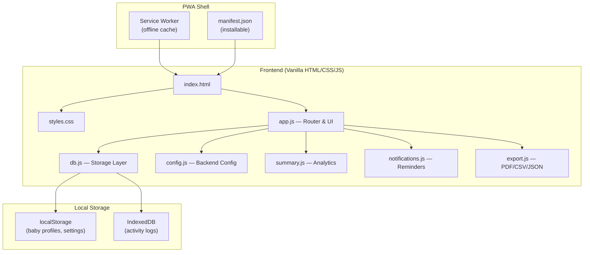

# Babylog by Plotkai — Baby Activity Tracker PWA

A Progressive Web App for tracking infant activities (feeds, diaper changes, sleep, etc.) entirely in the browser using local storage. No server required — works offline and installs on any device. Designed for future wrapping as native Android/iOS app.

## Reference UI


---

## Resolved Decisions (from your feedback)

| Decision | Resolution |
|---|---|
| Data backup | ✅ Export/Import JSON in hamburger menu |
| Brand colors | ✅ `#FF8000` (orange), `#4C1F7A` (deep purple), `#219B9D` (teal), `#EEEEEE` (light gray), black |
| Ad banner | ✅ Google Ads placeholder `<div>` with configurable ad slot ID |
| Multiple babies | ✅ Multi-baby support with name display & switcher on main screen |
| Notifications | ✅ Browser Notification API reminders (e.g., "Last feed was 3h ago") |
| Units | ✅ `ml` as default, configurable toggle to `oz` in settings |
| Summary export | ✅ PDF and CSV export from summary view |
| Install app | ✅ Install PWA button on Welcome screen + hamburger menu |
| Future native apps | ✅ Architecture kept wrapper-friendly for Android/iOS (Capacitor/TWA ready) |

---

## Architecture Overview



---

## Proposed Changes

### Project Structure

```
/Users/plotkai/products/babylogs/
├── index.html                # Single-page app shell
├── styles.css                # Full design system & responsive styles
├── manifest.json             # PWA manifest (installable)
├── sw.js                     # Service worker (offline support)
├── favicon.svg               # App icon
├── icons/
│   ├── icon-192.png
│   └── icon-512.png
├── js/
│   ├── app.js                # Main app logic, routing, UI rendering
│   ├── db.js                 # IndexedDB + localStorage abstraction
│   ├── config.js             # Loads & provides backend config
│   ├── summary.js            # Summary/analytics computation & charts
│   ├── notifications.js      # Browser notification reminders
│   ├── export.js             # Export: JSON backup, CSV, PDF
│   └── utils.js              # Date/time formatters, helpers
├── config/
│   └── baby-config.json      # Configurable backend data file
└── babylog-ui.png            # Reference wireframe (existing)
```

---

### 1. PWA Foundation

#### [NEW] [manifest.json](file:///Users/plotkai/products/babylogs/manifest.json)
- App name: "Babylog by Plotkai"
- Theme color: `#4C1F7A` (deep purple)
- Background color: `#EEEEEE`
- Display: `standalone`
- Orientation: `portrait`
- Icons: 192×192 and 512×512 (generated)
- Start URL: `./index.html`
- Categories: `["health", "lifestyle"]`

#### [NEW] [sw.js](file:///Users/plotkai/products/babylogs/sw.js)
- Cache-first strategy for all static assets
- Full offline functionality
- Versioned cache for clean updates
- Precaches: HTML, CSS, JS, config JSON, fonts, icons

---

### 2. Core UI — Single Page Application

#### [NEW] [index.html](file:///Users/plotkai/products/babylogs/index.html)

All screens rendered dynamically by JS. Single HTML shell with containers for each view.

---

#### Screen 1 — Welcome / Onboarding

Shown on first launch (no baby profiles in storage).

- App logo + "Babylog by Plotkai" heading
- Input fields: **Baby's Name**, **Date of Birth** (native date picker)
- **"Get Started"** button → saves profile, transitions to main screen
- **"Install App"** button — triggers the PWA `beforeinstallprompt` event to add to home screen. Hidden if already installed or not supported.
- Warm, inviting gradient background using brand colors

---

#### Screen 2 — Main Screen (Daily Timeline)

**Title Bar** (fixed top):
- Left: Hamburger menu icon `☰`
- Center: **"Babylog by Plotkai"**
- Right: (reserved)

**Baby Switcher** (below title bar):
- Shows current baby name with a dropdown/chip selector
- Tap to switch between babies
- `+ Add Baby` option in the dropdown

**Ad Banner Slot** (below baby switcher):
- Fixed-height `<div>` with `id="ad-banner-slot"`
- Height configurable in `baby-config.json` (default `60px`)
- Placeholder text: "Ad Space" (hidden when ad loads)
- Ready for Google AdSense script insertion — just add the ad unit ID

**Date Navigator**:
- `◀  18 August  ▶` with tap arrows
- Tapping the date text opens native date picker for jump-to-date
- Today indicator badge

**Activity Timeline**:
- Scrollable vertical list for the selected date, ordered by start time
- Each activity card shows:
  - Color-coded left border (by activity type from config)
  - Activity icon (emoji from config)
  - **Time range**: `11:46 AM - 12:10 PM`
  - **Description**: `Breast Feed - Right - Actively`
  - Duration badge: `24 min`
- **Tap** → opens Edit modal (same as Add, pre-filled)
- **Swipe left** or **long-press** → reveals Delete button with confirmation dialog
- **Empty state**: Friendly message + pulsing FAB prompt

**Floating Action Button (FAB)**:
- Bottom-center, circular `+` button
- Brand orange (`#FF8000`) with white `+` icon
- Subtle shadow + pulse animation on empty state
- Tap → opens Add Activity modal

**Last Feed Timer** (sticky footer, above FAB):
- Shows elapsed time since last feed: "Last feed: 2h 15m ago"
- Color changes: green (<2h), amber (2-3h), red (>3h)
- Tap to quickly add a new feed

---

#### Screen 3 — Add/Edit Activity Modal

Slides up from bottom as a bottom sheet with drag handle.

| Field | Type | Details |
|---|---|---|
| **Date** | Date picker | Pre-filled with selected date |
| **Time** | Time picker | Defaults to current time |
| **Duration** | Number input (minutes) | Auto-calculates and shows end time |
| **Event Type** | Grouped dropdown | Categories from config (Feeding, Output, Activity, Health) |
| **Dynamic Sub-fields** | Varies | Rendered based on selected event type (see below) |
| **Notes** | Textarea | Free text, optional |

**Dynamic Sub-fields by Event Type** (all driven by `baby-config.json`):

| Event Type | Sub-fields |
|---|---|
| Breast Feed | Side: Left/Right/Both · Latch: Actively/Passively/Comfort |
| Formula Feed | Quantity: number input (ml or oz based on setting) |
| Express Feed | Quantity: number input (ml or oz) |
| Poop | Color: Yellow/Green/Brown/Black/Red · Consistency: Watery/Soft/Formed/Hard |
| Wet | (none — just logs the event) |
| Diaper Change | Type: multi-select — Wet/Soiled/Dry |
| Sleep | Quality: Deep/Light/Restless |
| Medicine | Name: text · Dose: text |
| Temperature | Value: number (°F or °C configurable) |
| Weight Check | Value: number (kg or lb configurable) |

**Buttons**:
- **Save** (primary, brand orange)
- **Cancel** (secondary)
- **Delete** (only in edit mode, red, with "Are you sure?" confirmation)

**Display Text Generation**: Sub-field values are concatenated into the timeline label automatically:
- `"Breast Feed"` + `"Right"` + `"Actively"` → `"Breast Feed - Right - Actively"`
- `"Express Feed"` + `"40"` → `"Express Feed - 40ml"`

---

#### Screen 4 — Summary Dashboard (via hamburger menu → 📊 Summary)

**Period Selector**: `Day | Week | Month` toggle tabs at top

**Feed Summary Card**:
- Total breast feed count + total time
- Total formula quantity (ml/oz)
- Total expressed quantity (ml/oz)
- Average interval between feeds

**Output Summary Card**:
- Poop count + color/consistency breakdown
- Wet diaper count
- Total diaper changes

**Sleep Summary Card**:
- Total sleep hours
- Average nap duration
- Longest continuous stretch

**Expected Performance Panel** (from config, based on baby's current age):
- Shows age bracket label: e.g., "1-3 Months"
- For each metric, a horizontal bar showing:
  - Expected range (from config): e.g., "7-9 feeds/day"
  - Actual value plotted on the bar
  - Color: 🟢 green (within range), 🟠 amber (±20% outside), 🔴 red (far outside)
- Age-appropriate tips from config `notes` field

**Trend Charts** (Canvas API, no external libs):
- Feed frequency over time (bar chart)
- Sleep hours over time (line chart)
- Diaper output counts (stacked bar)

**Export Buttons**:
- 📄 Export as CSV
- 📋 Export as PDF
- Both export the currently viewed period's summary data

---

#### Hamburger Menu

| Item | Icon | Action |
|---|---|---|
| Summary | 📊 | Navigate to Summary Dashboard |
| Edit Baby Profile | ✏️ | Edit name, DOB of current baby |
| Add Baby | 👶 | Add a new baby profile |
| Switch Baby | 🔄 | Switch active baby (if multiple) |
| Settings | ⚙️ | Unit toggle (ml/oz), notification preferences |
| Export Data | 📤 | Download all data as JSON backup |
| Import Data | 📥 | Upload JSON to restore data |
| Install App | 📲 | Trigger PWA install prompt (hidden if already installed) |
| Clear All Data | 🗑️ | Double confirmation → erases everything |
| About | ℹ️ | Version, credits, "Babylog by Plotkai" |

---

### 3. Styling & Design System

#### [NEW] [styles.css](file:///Users/plotkai/products/babylogs/styles.css)

**Brand Color Palette**:

| Token | Color | Hex | Usage |
|---|---|---|---|
| `--color-primary` | Deep Purple | `#4C1F7A` | Title bar, headings, primary actions |
| `--color-accent` | Orange | `#FF8000` | FAB, Save buttons, active states, highlights |
| `--color-secondary` | Teal | `#219B9D` | Secondary buttons, links, chart accents |
| `--color-surface` | Light Gray | `#EEEEEE` | Backgrounds, card surfaces |
| `--color-text` | Black | `#000000` | Primary text |
| `--color-text-muted` | Dark Gray | `#666666` | Secondary text, timestamps |
| `--color-bg` | Near White | `#F8F8F8` | Page background |

**Dark Mode** (auto-detects `prefers-color-scheme: dark`):

| Token | Dark Value |
|---|---|
| `--color-bg` | `#121212` |
| `--color-surface` | `#1E1E1E` |
| `--color-text` | `#EEEEEE` |
| `--color-text-muted` | `#999999` |
| `--color-primary` | `#7B4DB5` (lighter purple for contrast) |
| Accent/Secondary | Stay vibrant |

**Activity Type Colors** (from config, used for card left-border and icons):

| Type | Color | Emoji |
|---|---|---|
| Breast Feed | `#7C5CFC` | 🤱 |
| Formula Feed | `#FF8FA3` | 🍼 |
| Express Feed | `#FF9F43` | 🥛 |
| Poop | `#A0522D` | 💩 |
| Wet | `#4A90D9` | 💧 |
| Diaper Change | `#6BBFA0` | 🧷 |
| Sleep | `#6C63FF` | 😴 |
| Tummy Time | `#4ECDC4` | 🐣 |
| Playtime | `#FFD93D` | 🎈 |
| Bath | `#74B9FF` | 🛁 |
| Medicine | `#E17055` | 💊 |

**Typography**: Google Fonts — `Outfit` (headings, bold), `Inter` (body, UI)

**Design Details**:
- 4px base grid spacing system
- Border radius: 12px cards, 24px buttons, full-round FAB
- Subtle box-shadows for depth
- Glassmorphism on modal overlay
- Smooth transitions on all interactive elements (200ms ease)

**Animations**:
- Modal: slide-up with spring easing (`cubic-bezier(0.34, 1.56, 0.64, 1)`)
- Activity cards: staggered fade-in on page load
- FAB: pulse glow on empty state
- Date change: crossfade transition
- Menu: slide-in from left with backdrop blur
- Delete: card shrinks and fades out
- Baby switcher: smooth dropdown expand

**Responsive Breakpoints**:
- Mobile-first: `< 480px` (primary target)
- Tablet: `480px - 768px`
- Desktop: `> 768px` (max-width container centered)

---

### 4. Data Layer

#### [NEW] [js/db.js](file:///Users/plotkai/products/babylogs/js/db.js)

**App Settings** (localStorage):
```json
{
  "activeBabyId": "uuid-1",
  "unit": "ml",
  "notificationsEnabled": true,
  "feedReminderInterval": 180
}
```

**Baby Profiles** (localStorage — array):
```json
[
  {
    "id": "uuid-1",
    "name": "Baby Name",
    "dob": "2026-07-15",
    "createdAt": "2026-08-01T10:00:00Z"
  }
]
```

**Activity Entry** (IndexedDB — `babylog` database, `activities` store):
```json
{
  "id": "uuid-v4",
  "babyId": "uuid-1",
  "date": "2026-08-18",
  "startTime": "2026-08-18T11:46:00",
  "duration": 24,
  "endTime": "2026-08-18T12:10:00",
  "eventType": "breast_feed",
  "subFields": {
    "side": "right",
    "latchQuality": "actively"
  },
  "notes": "",
  "displayText": "Breast Feed - Right - Actively",
  "createdAt": "2026-08-18T11:46:00Z",
  "updatedAt": "2026-08-18T11:46:00Z"
}
```

**IndexedDB Indexes**:
- `[babyId, date]` — compound index for per-baby daily queries
- `[babyId, eventType]` — for summary filtering by baby
- `startTime` — for chronological ordering

**Key Operations**:
- `addActivity(entry)` — insert new activity
- `updateActivity(id, updates)` — update existing
- `deleteActivity(id)` — remove with confirmation
- `getActivitiesByDate(babyId, date)` — timeline query
- `getActivitiesByRange(babyId, startDate, endDate)` — summary query
- `exportAll()` → JSON blob of all profiles + activities
- `importAll(json)` → validates and restores data

---

### 5. Notifications / Reminders

#### [NEW] [js/notifications.js](file:///Users/plotkai/products/babylogs/js/notifications.js)

- Requests `Notification.permission` on first enable
- Tracks last feed time from IndexedDB
- Uses `setInterval` (while app is open) to check elapsed time
- Configurable reminder interval (default: 3 hours, stored in settings)
- Notification content: "🍼 Last feed was 3h ago — time for a feed?"
- Tap notification → opens the app / brings to foreground
- Can be toggled on/off from Settings in hamburger menu

> [!NOTE]
> Browser notifications only work while the app tab is open or the PWA is running. For native push notifications, the future Android/iOS wrapper will handle that.

---

### 6. Export Module

#### [NEW] [js/export.js](file:///Users/plotkai/products/babylogs/js/export.js)

**JSON Export/Import** (full backup):
- Exports all baby profiles + all activities as a single JSON file
- `babylog-backup-2026-08-18.json`
- Import validates structure, merges or replaces data

**CSV Export** (summary data):
- Exports current summary period as CSV
- Columns: Date, Time, Duration, Event Type, Details, Notes
- `babylog-summary-august-2026.csv`

**PDF Export** (summary report):
- Uses browser `window.print()` with a print-optimized CSS stylesheet
- Renders the summary dashboard in a clean printable layout
- User can "Save as PDF" from the print dialog
- No external PDF library needed

---

### 7. Backend Configuration

#### [NEW] [config/baby-config.json](file:///Users/plotkai/products/babylogs/config/baby-config.json)

This single file controls **all** activity types, sub-fields, dropdown options, colors, expected performance milestones, units, and ad configuration. Editing this file changes the entire app's behavior — no code changes needed.

**Structure** (abbreviated — full version shown earlier in resolved plan):

```json
{
  "activityCategories": {
    "feeding": {
      "label": "Feeding",
      "icon": "🍼",
      "types": {
        "breast_feed": {
          "label": "Breast Feed",
          "color": "#7C5CFC",
          "fields": [
            { "key": "side", "label": "Side", "type": "select",
              "options": ["Left", "Right", "Both"], "required": true },
            { "key": "latchQuality", "label": "Latch Quality", "type": "select",
              "options": ["Actively", "Passively", "Comfort"], "required": false }
          ]
        },
        "formula_feed": { "..." },
        "express_feed": { "..." }
      }
    },
    "output": { "..." },
    "activity": { "..." },
    "health": { "..." }
  },
  "expectedPerformance": {
    "0-1_month": {
      "label": "Newborn (0-4 weeks)",
      "feeds_per_day": { "min": 8, "max": 12 },
      "wet_diapers_per_day": { "min": 6, "max": 10 },
      "poop_per_day": { "min": 3, "max": 8 },
      "sleep_hours_per_day": { "min": 14, "max": 17 },
      "notes": "Feed on demand, typically every 2-3 hours."
    },
    "1-3_months": { "..." },
    "3-6_months": { "..." },
    "6-12_months": { "..." }
  },
  "units": {
    "volume": { "default": "ml", "options": ["ml", "oz"], "conversionFactor": 0.033814 },
    "weight": { "default": "kg", "options": ["kg", "lb"], "conversionFactor": 2.20462 },
    "temperature": { "default": "F", "options": ["F", "C"] }
  },
  "notifications": {
    "feedReminderDefault": 180,
    "reminderOptions": [120, 150, 180, 210, 240]
  },
  "adBanner": {
    "enabled": true,
    "height": "60px",
    "adSlotId": "",
    "adClient": "",
    "placeholder": "Ad Space"
  },
  "app": {
    "title": "Babylog by Plotkai",
    "version": "1.0.0"
  }
}
```

---

### 8. Summary & Analytics

#### [NEW] [js/summary.js](file:///Users/plotkai/products/babylogs/js/summary.js)

- Queries IndexedDB for the selected baby + period (day/week/month)
- Computes all metrics: feed counts, quantities, intervals, diaper counts, sleep totals
- Compares against `expectedPerformance` from config using baby's age (from DOB)
- Renders trend charts using `<canvas>` (no external libraries)
- Feeds data to CSV/PDF export functions

---

### 9. PWA Install Flow

#### Install prompt handled in [js/app.js](file:///Users/plotkai/products/babylogs/js/app.js)

- Captures the `beforeinstallprompt` event
- Shows **"📲 Install App"** button in two places:
  1. Welcome screen (below "Get Started")
  2. Hamburger menu
- On tap → triggers the deferred install prompt
- After install → hides the install buttons
- Detects if running in standalone mode → hides install option

---

## Key Enhancements Over the Wireframe

| Wireframe | Enhanced Version |
|---|---|
| Single baby | Multi-baby with switcher on main screen |
| Plain text timeline | Color-coded cards with emoji icons, duration badges, type-colored borders |
| Basic 4-field modal | Smart modal with dynamic sub-fields driven by config |
| No summary | Full analytics dashboard with day/week/month views + trend charts |
| No data safety | Export/Import JSON, CSV summary, PDF report |
| No offline | Full PWA with service worker |
| No dark mode | Auto dark mode for late-night use |
| No reminders | Browser notification reminders for feed intervals |
| No install | Install App button on welcome + hamburger menu |
| No expected performance | Age-based expected ranges with color-coded indicators |
| Hardcoded activity types | All types, fields, colors configurable from single JSON file |

---

## Verification Plan

### Manual Verification
1. **First Launch**: Welcome screen → enter name + DOB → main screen transition
2. **Multi-baby**: Add second baby → switcher appears → switch between babies → correct data per baby
3. **Add Activities**: Test all event types, verify dynamic sub-fields, check timeline display text
4. **Edit/Delete**: Tap card → edit modal pre-filled → save updates → delete with confirmation
5. **Date Navigation**: Forward/back arrows → correct activities → date picker jump
6. **Summary**: Day/week/month views → verify counts → expected performance colors
7. **Export/Import**: JSON export → clear data → JSON import → data restored correctly
8. **CSV/PDF Export**: Export summary → verify file contents
9. **Notifications**: Enable → wait for interval → notification appears
10. **PWA Install**: "Install App" button → install prompt → opens as standalone app
11. **Offline**: Disconnect internet → full app functionality persists
12. **Dark Mode**: Toggle system theme → all screens render correctly
13. **Responsive**: Mobile (375px), Tablet (768px), Desktop (1440px)
14. **Edit Profile**: Change name/DOB from menu → verify updates across app
15. **Unit Toggle**: Switch ml ↔ oz → all quantities recalculated in UI

### Automated
- Config validation: app logs warnings for missing required fields in `baby-config.json`
- Service worker: log cache hits/misses in dev console

---

## Tech Summary

| Aspect | Choice |
|---|---|
| Framework | Vanilla HTML/CSS/JS — zero build tools, zero npm dependencies |
| Storage | IndexedDB (activities) + localStorage (profiles, settings) |
| Offline | Service Worker, cache-first |
| Installable | PWA manifest + install prompt handler |
| Config | Editable `config/baby-config.json` |
| Charts | Canvas API |
| Export | JSON (backup), CSV (summary), PDF (print stylesheet) |
| Notifications | Browser Notification API |
| Icons | Emoji + inline SVG |
| Fonts | Google Fonts: Outfit, Inter |
| Future native | Architecture ready for Capacitor / TWA wrapping |
| **Total deps** | **Zero** |
